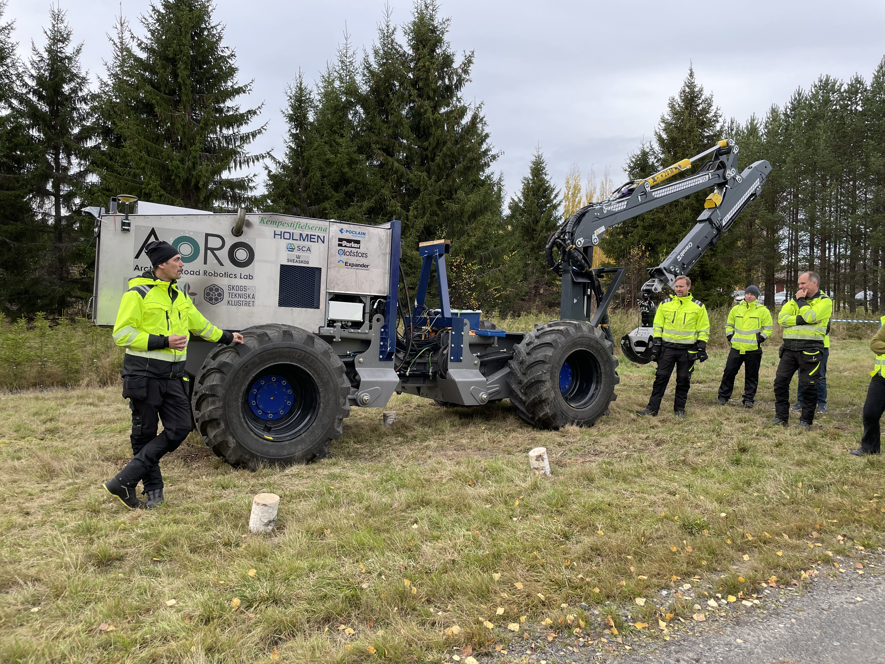

<em> Magnus Karlberg (left), Håkan Lideskog (second left), Morgan Rossander (third left, Skogforsk), and Torbjörn Lindbäck (right) are demonstrating the vehicle's capabilities for autonomous planting as part of the [Autoplant](https://www.skogforsk.se/projekt/autoplant/) project. Excursion at Skogforsk in Sävar, Sweden, 2022. </em>

 ## Hardware
- In-house developed research platform
- Cranab FC8 DT crane, Fully sensorized
- John Deere PowerTech 4045HF475, four cylinder Diesel Engine

## Data
- Weight: ~10 000 kg
- Power: 129 kW (175 hp)

## Sensors
- GNSS (Leica iCG82 + iCON GPS 80)
    - [SWEPOS](https://www.lantmateriet.se/en/geodata/gps-geodesy-and-swepos/swepos/) Network RTK
- Lidar & stereo cameras
    - SICK MRS6124
    - Velodyne VELARRAY solid state Lidar
    - 2x ZED2i, 2x [ZED2](https://www.stereolabs.com/en-se/products/zed-2)
- 4x STURDeCAM for Nvidia Jetson Xavier
- IMU (Both external and utilizing ZED2)

## Hydraulics
- Parker [K170](https://www.parker.com/content/dam/Parker-com/Literature/Mobile-Hydraulic-Systems-Division---Europe/HY17-8557-UK_K170.pdf) Hydraulic Valves
- Parker [L90LS](https://www.parker.com/content/dam/Parker-com/Literature/Mobile-Hydraulic-Systems-Division---Europe/MSG17-8504-UK_L90LS.pdf) Hydraulic Valves
- Poclain [P90R130](https://www.sauerbibus.de/fileadmin/editors/countries/sab/Produkte/Poclain/Pumpen/PDF_Neu/PL_20170220_EN.pdf) Hydraulic pump
- 4x Poclain [MSE18](https://poclain.com/products/hydraulic-motors/ms-multipurpose/ms18-mse18-motor-max-2812cc-70-kw) motors (Locomotion)
- Bosch rexroth [A10V O140](https://store.boschrexroth.com/sv/se/axial-piston-variable-pumps) Hydraulic pump (Auxillary functions)
- Pressure sensors on all hydraulic cylinders

## On-board computers
- [Nvidia Jetson Xavier](https://www.nvidia.com/en-us/autonomous-machines/embedded-systems/jetson-xavier-series/)
- [Ueidaq I/O](https://www.ueidaq.com/)
- [Nuvo-7168GC-002](https://www.neousys-tech.com/en/product/product-lines/edge-ai-gpu-computing/nuvo-7168gc-intel-9th-nvidia-rtx-gpu-embedded-computing) with RTXA2000 GPU

    ### Software
    - Mevea (Digital Twin)
    - Unity
    - Matlab/Simulink
    - ROS & ROS2

